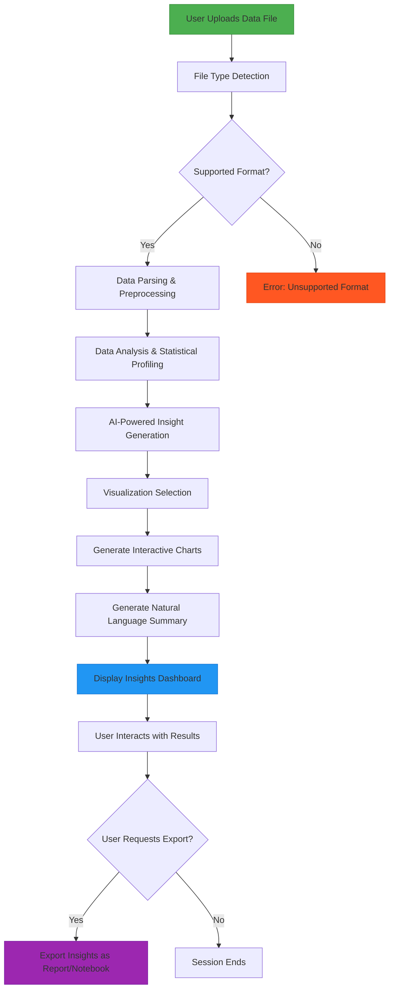

# 🔮 Dattavism (दत्ताविस्म)

Dattavism is an intelligent, AI-powered data insight platform built with Python, Streamlit, Gemini API, Pandas, Matplotlib, NumPy, and MySQL. It enables users from any domain—business, science, medical, social research—to upload a CSV dataset and receive a full, contextual report of patterns, visualizations, summaries, and insights without writing a single line of code.

### 🚀 What Dattavism can do 

- 📂 Accepts CSV data of any domain (business, science, healthcare, etc.)
- 🧠 Uses Gemini AI to understand the data context and generate meaningful narratives
- 📊 Automatically generates charts based on key patterns
- 📈 Allows custom visualizations with user-selected parameters
- 🤖 Supports Q&A—users can ask natural-language questions about the data
- 📄 Generates a downloadable insight report (PDF) including summaries, charts, and recommendations


# Quick Start Demo

###  🧪 How It Works

1. Upload your CSV file
2. Backend processes and understands your data
3. Gemini API generates textual descriptions and business insights
4. Visual charts and analytics are rendered dynamically
5. User can ask questions and customize visualizations
6. Export a downloadable PDF/Markdown report

# 🔑 Prerequisites
    Python 3.8+

    Google Gemini API Key

# 📦 Installation

```bash
git clone https://github.com/UnnatMalik/Dattavism-AI-Powered-Data-Insight-Generator-.git
cd Dattavism-AI-Powered-Data-Insight-Generator-

# Install dependencies
pip install -r requirements.txt

# Set Up Environment Variable
setx GEMINI_API_KEY "your_gemini_api_key"

# run streamlit app
streamlit run main.py

```

# ⚙️  Technologies


| Layer        | Tools/Technologies                  |
|--------------|-------------------------------------|
| Language   |                                           |
| Frontend     | |
| AI Engine    |                           |
| Data Engine  |    | 
| Reporting    |      |


# 🗺️ Roadmap



